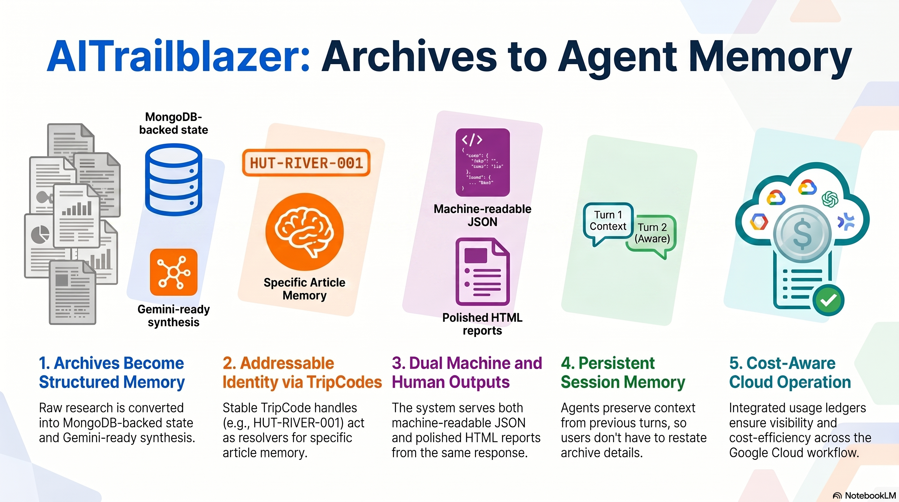
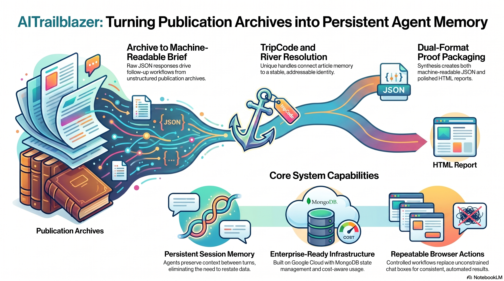

# AITrailblazer AI Agent Publishing

**Turn a publication archive into reusable agent memory.**

AITrailblazer AI Agent Publishing is a Google Cloud Rapid Agent Hackathon project that converts published research into structured, agent-readable context: article objects, TripCodes, River continuity, MongoDB-backed state, Gemini-ready synthesis, and reusable reader packets.

<p>
  <a href="https://aitrailblazer-ai-agent-publishing-rmycwek6ba-uc.a.run.app/"><strong>Live App</strong></a>
  ·
  <a href="https://aitrailblazer-ai-agent-publishing-rmycwek6ba-uc.a.run.app/demo/"><strong>Browser Demo</strong></a>
  ·
  <a href="https://aitrailblazer-ai-agent-publishing-rmycwek6ba-uc.a.run.app/demo/run"><strong>Manual Controls</strong></a>
</p>



## What The Demo Shows

Most publication archives are valuable but hard for agents to use. Articles, source links, and follow-up context usually stay trapped as static pages. This project turns that archive into a repeatable agent workflow:

1. **Archive content becomes article objects.**
2. **TripCodes provide stable resolver keys.**
3. **Rivers group related articles into reusable memory.**
4. **MongoDB-shaped context stores archive, claim, River, session, and run records.**
5. **Gemini-ready synthesis converts raw proof into a reader-facing packet.**

The browser demo shows the proof path end to end: raw JSON first for auditability, then a rendered HTML packet for a user-facing result.



## Why It Matters

This is not just a static website or a chatbot over article text. The project demonstrates a production-shaped loop:

- **Discover** the available runtime surface.
- **Invoke** a TripCode/River workflow.
- **Verify** the returned evidence packet.
- **Remember** session context for follow-up.
- **Render** the final result as a reusable reader packet.

That makes a publication archive useful to humans, browser users, API clients, and future agent-to-agent workflows.

## Live Routes

| Surface | Route |
| --- | --- |
| Landing page | `GET /` |
| Browser demo | `GET /demo/` |
| Manual controls | `GET /demo/run` |
| Health check | `GET /health` |
| Usage ledger | `GET /v1/usage` |
| Archive brief | `POST /v1/archive-brief` |
| TripCode resolve | `POST /v1/tripcode` |
| Judge-friendly resolve | `GET|POST /resolve` |

## Local Run

```bash
GOWORK=off go test ./...
PORT=8080 GOWORK=off go run ./cmd/server
```

Open:

```text
http://127.0.0.1:8080/
http://127.0.0.1:8080/demo/
http://127.0.0.1:8080/demo/run
```

## Verification

```bash
make test
make validate
make run
npm ci
npm run check:playwright
```

## Deployment

The public service is deployed on Google Cloud Run:

```bash
make deploy
```

The container includes the Go HTTP service, static visual pages, demo screenshots, and MongoDB-oriented runtime support for the hackathon proof path.

## Project Files

| File | Purpose |
| --- | --- |
| `index.html` | Minimal public landing page |
| `START_HERE.html` | Manual walkthrough and replay instructions |
| `VIDEO_SLIDES.html` | Video script and slide sequence |
| `PROJECT_README.html` | Long-form visual project notes |
| `docs/*.html` | Self-contained public visual specs |
| `cmd/server` | Go Cloud Run service |
| `internal/agent` | Coordinator, TripCode resolver, memory store, and cost tracker |
| `scripts/judge-demo.sh` | Curl-based demo flow |

No API keys, private screenshots, or local operator artifacts are required to run the public demo paths.
